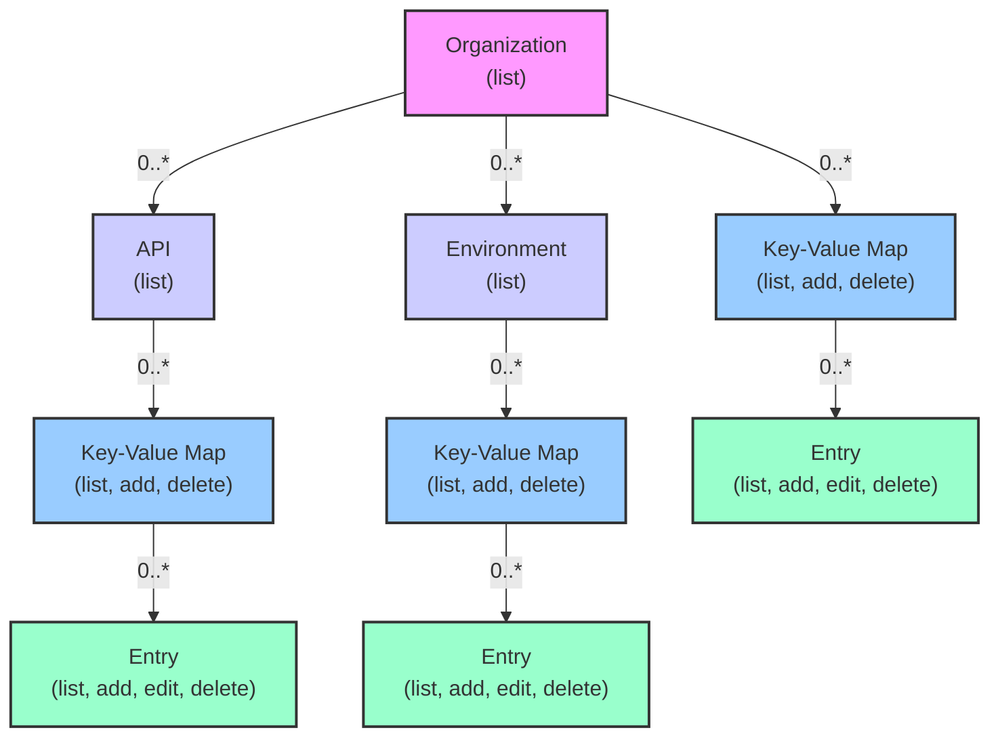

# Structure

```mermaid
graph TD;
    %% Define Nodes with Module Name and Methods
    Org["Organization<br/>(list)"]:::level1;
    API["API<br/>(list)"]:::level2;
    Env["Environment<br/>(list)"]:::level2;
    OrgKVM["Key-Value Map<br/>(list, add, delete)"]:::level3;
    ApiKVM["Key-Value Map<br/>(list, add, delete)"]:::level3;
    EnvKVM["Key-Value Map<br/>(list, add, delete)"]:::level3;
    OrgEntry["Entry<br/>(list, add, edit, delete)"]:::level4;
    ApiEntry["Entry<br/>(list, add, edit, delete)"]:::level4;
    EnvEntry["Entry<br/>(list, add, edit, delete)"]:::level4;

    %% Define Relationships and Cardinality
    Org -- "0..*" --> API;
    Org -- "0..*" --> Env;
    Org -- "0..*"--> OrgKVM;

    API -- "0..*" --> ApiKVM;
    Env -- "0..*" --> EnvKVM;

    OrgKVM -- "0..*" --> OrgEntry;
    ApiKVM -- "0..*" --> ApiEntry;
    EnvKVM -- "0..*" --> EnvEntry;

    %% Optional Styling (adjust colors/shapes as needed)
    classDef level1 fill:#f9f,stroke:#333,stroke-width:2px;
    classDef level2 fill:#ccf,stroke:#333,stroke-width:2px;
    classDef level3 fill:#9cf,stroke:#333,stroke-width:2px;
    classDef level4 fill:#9fc,stroke:#333,stroke-width:2px;
```
